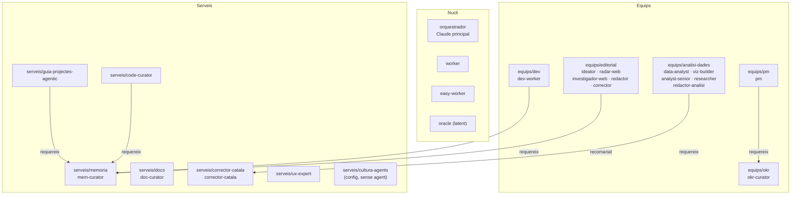

# GRAPH.md — Mapa de dependències del sistema

Font de veritat per a agents i humans. Si un MANIFEST.md i aquest fitxer discrepesquen → aquest mana.
Actualitzar quan s'afegeixi o elimini un component.

---

## Agents per component

| ID  | Nom | Rol funcional | Component | Tipus | Fitxer |
|-----|-----|---------------|-----------|-------|--------|
| A01 | orquestrador | Coordina agents, gestiona flux de sessió | — | nucli | Claude principal |
| A02 | worker | Executa tasques amb judici tàctic | nucli | nucli | `nucli/worker.md` |
| A03 | easy-worker | Executa tasques mecàniques (git, fitxers, scripts) | nucli | nucli | `nucli/easy-worker.md` |
| A04 | oracle | Criteri arquitectònic independent. Latent. | nucli | nucli | `nucli/oracle.md` |
| A05 | pm | Coordina flux intern, defineix i valida tasques | equips/pm | equip | `equips/pm/agents/pm.md` |
| A06 | okr-curator | Gestiona registres OKR, tasques i KRs | equips/okr | equip | `equips/okr/agents/okr-curator.md` |
| A07 | dev-worker | Implementa codi amb protocols de qualitat | equips/dev | equip | `equips/dev/agents/dev-worker.md` |
| A08 | data-analyst | Executa consultes SQL via MCP | equips/analisi-dades | equip | `equips/analisi-dades/agents/data-analyst.md` |
| A09 | viz-builder | Genera gràfics ECharts (HTML+PNG) | equips/analisi-dades | equip | `equips/analisi-dades/agents/viz-builder.md` |
| A10 | analyst-senior | Interpretació experta de dades (Opus) | equips/analisi-dades | equip | `equips/analisi-dades/agents/analyst-senior.md` |
| A11 | researcher | Cerca externa per contrastar hipòtesis | equips/analisi-dades | equip | `equips/analisi-dades/agents/researcher.md` |
| A12 | redactor-analisi | Coherència narrativa del document final | equips/analisi-dades | equip | `equips/analisi-dades/agents/redactor-analisi.md` |
| A13 | ideator | Genera idees d'articles a partir de tendències | equips/editorial | equip | `equips/editorial/agents/ideator.md` |
| A14 | radar-web | Detecta tendències i novetats web | equips/editorial | equip | `equips/editorial/agents/radar-web.md` |
| A15 | investigador-web | Cerca i verifica fonts per a articles | equips/editorial | equip | `equips/editorial/agents/investigador-web.md` |
| A16 | redactor | Redacta articles amb veu i brief declarats | equips/editorial | equip | `equips/editorial/agents/redactor.md` |
| A17 | corrector | Revisió editorial (brief, coherència, facts) | equips/editorial | equip | `equips/editorial/agents/corrector.md` |
| A18 | mem-curator | Consolida memòria flash → short-term → skills | serveis/memoria | servei | `serveis/memoria/agents/mem-curator.md` |
| A19 | doc-curator | Custòdia documental entre sessions | serveis/docs | servei | `serveis/docs/agents/doc-curator.md` |
| A20 | corrector-catala | Correcció lingüística normativa catalana (IEC) | serveis/corrector-catala | servei | `serveis/corrector-catala/agents/corrector-catala.md` |
| A21 | guia-projectes-agentic | Manté i fa créixer el sistema agèntic | serveis/guia-projectes-agentic | servei | `serveis/guia-projectes-agentic/agents/guia-projectes-agentic.md` |
| A22 | code-curator | Auditoria arquitectònica del codebase | serveis/code-curator | servei | `serveis/code-curator/agents/code-curator.md` |
| A23 | ux-expert | Revisió UX per a projectes amb interfície | serveis/ux-expert | servei | `serveis/ux-expert/agents/ux-expert.md` |

---

## Processos i commands registrats

### Processos (disparats pel sistema)

| ID | Nom (BPMN) | Actors principals | Disparador | Fitxer |
|----|-----------|-------------------|-----------|--------|
| PROC-001 | Execució de tasca | pm, dev-worker, okr-curator, easy-worker | Usuari proposa tasca nova | `processos/executar-tasca.md` |
| PROC-002 | Tancament de tasca | pm, okr-curator, oracle | PM valida que l'evidència cobreix el DoD | `processos/tancar-tasca.md` |
| PROC-003 | Obertura de roadmap | pm, oracle, okr-curator | Roadmap actual tancat | `processos/nou-roadmap.md` |
| PROC-004 | Gestió de deutes | pm, okr-curator | Worker o PM detecta deute fora del scope | `processos/gestio-deutes.md` |

### Commands (disparats per l'usuari)

| ID | Nom (BPMN) | Actors principals | Quan usar-lo | Fitxer |
|----|-----------|-------------------|-------------|--------|
| CMD-001 | Inici de tasca següent | pm, dev-worker, okr-curator | Usuari dona go per tancar i obrir la següent | `commands/tasca-seguent.md` |
| CMD-002 | Revisió d'opinió externa | pm, oracle, dev-worker | Arriba feedback extern sobre tasca en curs | `commands/revisa-opinio.md` |

---

## Dependències entre components

| Component | Depèn de | Tipus |
|-----------|----------|-------|
| equips/pm | equips/okr | obligatòria |
| equips/dev | serveis/memoria | obligatòria |
| equips/analisi-dades | serveis/corrector-catala | obligatòria |
| equips/editorial | serveis/memoria | recomanada |
| serveis/guia-projectes-agentic | serveis/memoria | obligatòria |
| serveis/code-curator | serveis/memoria | obligatòria |
| serveis/ux-expert | — | cap |
| serveis/corrector-catala | — | cap |
| serveis/docs | — | cap |
| serveis/memoria | — | cap |

---

## Serveis per activar (referència ràpida)

| Servei | Obligatori? | Quan activar |
|--------|-------------|--------------|
| `serveis/memoria` | Sí — sempre | Tot projecte |
| `serveis/docs` | No | Projectes amb documentació recurrent |
| `serveis/corrector-catala` | No | Projectes que produeixen text en català |
| `serveis/cultura-agents` | No | Quan es vol donar veu i personalitat als agents *(sense agent dedicat — activa via fitxers de configuració)* |
| `serveis/guia-projectes-agentic` | No | Quan el sistema agèntic ja porta camí i cal mantenir-lo |
| `serveis/code-curator` | No | Projectes amb codebase de producció per capes |
| `serveis/ux-expert` | No | Projectes amb component UI/interfície |

---

## Mapa visual

